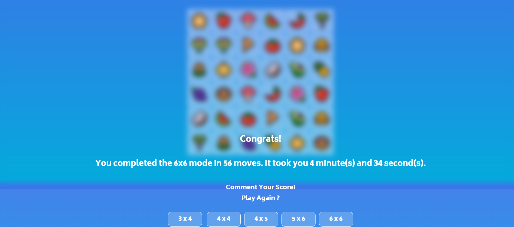

# 

<!-- ## <b> [Memory matching game](https://debjit20504.github.io/Memory-Matching_game/) -->

Memory Matching Game is a simple online fun game, which contains various levels. It also calculates how many moves and how much time taken by a player to finish the game.
This project is made using HTML,CSS &amp; JavaScript.

It's a simple online memory matching game, which contains various levels.
 
Here are some snapshots from game.

  